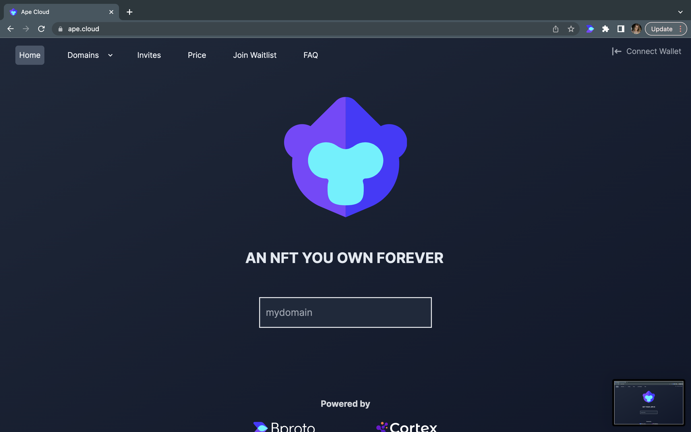
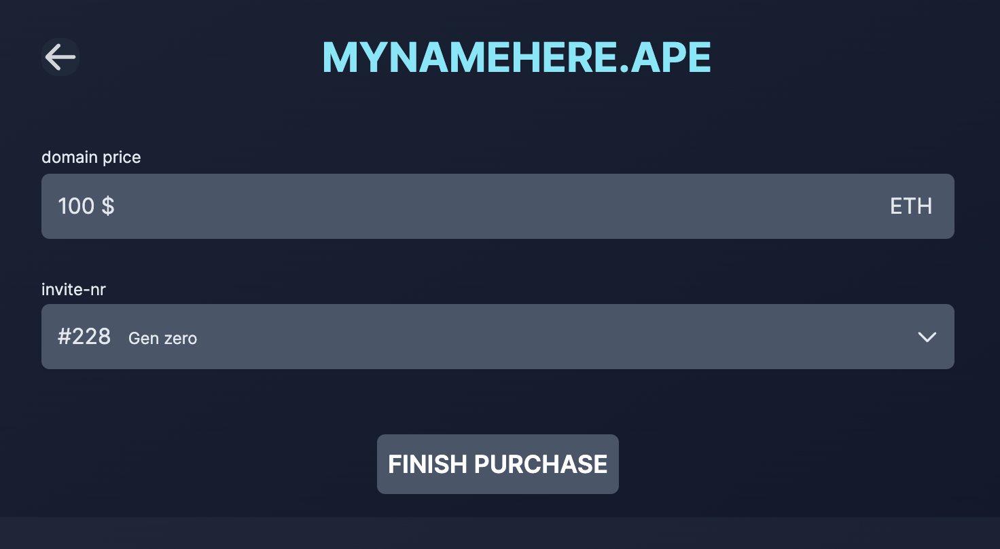

# Ape Cloud

Cortex Press is live for all .ape domain owners. To purchase your domain, visit  https://ape.cloud. Don't own a .ape domain? Reach out to the team on  [Telegram](https://t.me/dotapefam) or purchase an unused token on the Official .ape collection  [Opensea](https://opensea.io/collection/ape-cloud-invitation). 
## Purchasing

First, it's important to understand what a .ape domain is and why it's valuable. Owning a .ape domain can increase privacy, security, and control over your online identity and content. Check out the 12 reasons why a .ape domain is different than other domain projects, here: https://medium.com/cortex-app/top-twelve-reasons-ape-domain-nfts-are-different-from-other-domain-name-nft-projects-c486194a47c3

1. Once you're ready to purchase a .ape domain, you'll need to receive a .ape token. You can confirm if you have a .ape token by visiting https://opensea.io/collection/ape-cloud-invitation and checking your "hidden" folder under "More". If you don't have a .ape token yet, you'll need to acquire one through a secondary market such as OpenSea or by reaching out to our team on our Telegram, https://t.me/dotapefam
2. Once you have your .ape token, visit ape.cloud and sign in using Metamask. If you don't have Metamask, you'll need to download it and set up a wallet. 
3. Enter the domain name of your choice to see if it's available for purchase. Hit "Start Purchase" to proceed to purchasing screen. 

4. You'll see the purchase amount displayed in ETH or $$. If you want to know the cost of your domain before getting an invite, you can check out the price breakdown at https://ape.cloud/price. 
5. Select the invite you want to use from the drop-down menu, and hit "Finish Purchase" to buy your domain.

6. Once you've purchased your domain, you can update your image metadata or publish content to it using https://cortex.press. If you want to host your own static site using a CID in "Advanced Mode," we have provided a guide here: (put link to advanced mode)
7. Yay! Once your content is published, share it with us on Twitter and the .ape fam Telegram. 

If you encounter any issues during the purchase process, try troubleshooting common problems such as Metamask errors or issues with your wallet. Additionally, you can reach out to the ape.cloud team via Telegram.

### Watch the tutorial here:

## Subdomains

Ready to Create a Subdomain for your .ape domain? 

### Here is a quick guide on how:

1. Make sure you are logged into https://ape.cloud by connecting your wallet using Metamask.
2. If you haven't already, mint a .ape domain using the instructions in the previous walkthrough.
3. Click on "Domains" in the navigation bar.
4. Find the .ape domain you wish to mint a subdomain for and click on it.
5. Once you're on the domain page, click on "Add Subdomain".
6. Type in the name of the subdomain you want to create. Note that while minting is free, you will need to pay current gas fees on all subdomains. Your subdomain also will not be associated with ENS like your domain currently is. 
7. Hit enter. You will be prompted to sign and pay any gas fees. Wait for the transaction to be confirmed on the blockchain. This can take a few minutes depending on the current gas fees and network congestion.
8. Once your subdomain is minted, you can update the image metadata using https://cortex.press. 
9. Congratulations! You have successfully minted a subdomain for your .ape domain.

### Watch the tutorial here:

